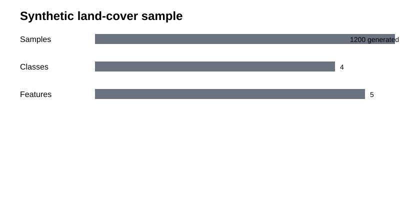
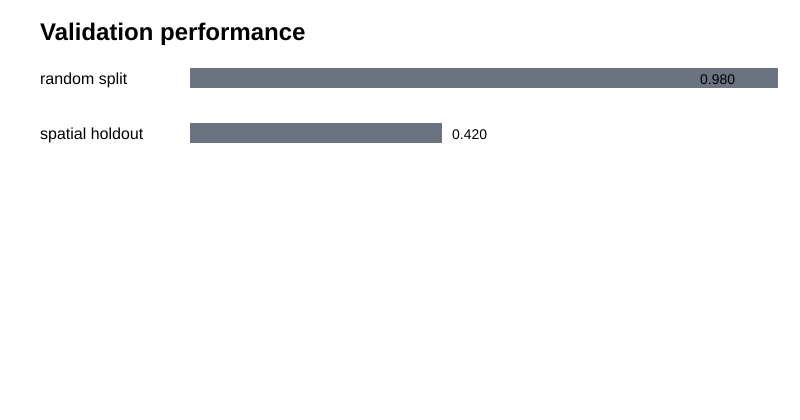
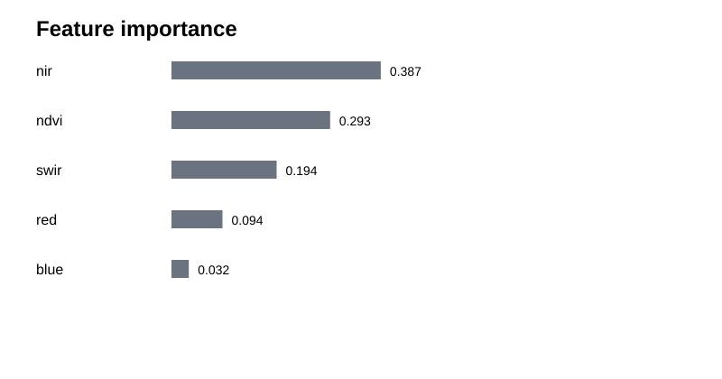

# Geospatial Land-Cover ML with Spatial Validation

A reproducible geospatial machine-learning project demonstrating **why spatial validation matters** for land-cover classification.

> **Transparency:** committed data and metrics are synthetic demonstration outputs, not production mapping results.

## Technical highlights
- Multispectral-style features: blue, red, NIR, SWIR, NDVI
- Random Forest classification
- Random train/test split vs spatial holdout benchmark
- Feature importance and machine-readable results
- Runnable script, notebook, tests, figures, and sample data

## Results
| Validation | Accuracy | Macro F1 |
|---|---:|---:|
| Random split | **0.980** | **0.982** |
| Spatial holdout | **0.420** | **0.151** |





## Run
```bash
pip install -r requirements.txt
python scripts/run_demo.py
python -m pytest -q
```

## Key takeaway
This project demonstrates that geospatial ML evaluation should respect spatial structure rather than rely only on random row-level splits. Spatial holdout exposes generalization weaknesses that can remain hidden under random validation.

## Applications
The same validation principle is relevant to land-cover mapping, vegetation classification, agricultural remote sensing, habitat modeling, environmental prediction, and other spatial machine-learning problems where nearby observations are not statistically independent.
