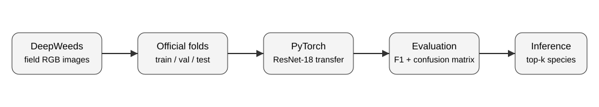

# Deep Learning for Weed-Species Classification with PyTorch

A reproducible computer-vision workflow for **multiclass weed and vegetation classification** using the public [DeepWeeds](https://github.com/AlexOlsen/DeepWeeds) dataset and PyTorch transfer learning.

This project was built as a focused extension of my geospatial machine-learning portfolio to demonstrate an end-to-end deep-learning workflow relevant to vegetation monitoring, ecological image analysis, precision agriculture, and invasive-species surveillance.



## Why this project

Remote-sensing and ecological applications increasingly combine field observations with machine learning and deep learning. This workflow demonstrates the computer-vision side of that stack:

**field imagery → reproducible splits → augmentation → CNN transfer learning → validation → class-level diagnostics → inference**

The project uses **DeepWeeds**, which contains 17,509 in-situ images spanning eight weed species plus a negative class. It is a useful open benchmark for vegetation discrimination under variable field backgrounds.

> **Scope note:** DeepWeeds uses ground RGB imagery. This repository demonstrates PyTorch/CNN classification competence and does not claim that ground RGB classification is equivalent to landscape-scale invasive-species mapping from hyperspectral, UAV, or satellite data.

## Technical highlights

- **PyTorch + torchvision**
- ImageNet-pretrained **ResNet-18** transfer learning
- Official DeepWeeds **train/validation/test folds**
- Reproducible random seeds
- Field-image augmentation
- Optional class-weighted loss
- AdamW optimization
- Mixed-precision training on CUDA
- Early stopping and learning-rate scheduling
- Accuracy, macro/weighted F1, precision, recall
- Classification report and confusion matrix
- Single-image top-k inference
- Unit tests that run without downloading the 491 MB image archive
- CI-ready project structure

## Dataset

DeepWeeds was introduced by Olsen et al. and contains **17,509 RGB field images** of eight weed species plus negative examples collected across Queensland, Australia.

Species/classes:
1. Chinee apple
2. Lantana
3. Parkinsonia
4. Parthenium
5. Prickly acacia
6. Rubber vine
7. Siam weed
8. Snake weed
9. Negative

Dataset and annotations: **CC BY 4.0**  
Original repository: https://github.com/AlexOlsen/DeepWeeds  
Dataset archive: https://zenodo.org/records/7939060  
Paper DOI: https://doi.org/10.1038/s41598-018-38343-3

The dataset is **not committed** to this repository.

## Repository layout

```text
.
├── assets/
│   └── workflow.svg
├── docs/
│   └── methodology.md
├── results/
│   └── README.md
├── scripts/
│   ├── download_data.py
│   ├── train.py
│   ├── evaluate.py
│   └── predict.py
├── src/deepweeds_pytorch/
│   ├── data.py
│   ├── engine.py
│   ├── model.py
│   └── reporting.py
├── tests/
│   ├── test_dataset.py
│   └── test_model.py
└── requirements.txt
```

## 1. Environment

Python 3.10+ is recommended.

```bash
python -m venv .venv
source .venv/bin/activate   # Windows: .venv\Scripts\activate
pip install -r requirements.txt
```

For GPU training, install the PyTorch build appropriate for your CUDA version from the official PyTorch instructions.

## 2. Download DeepWeeds

```bash
python scripts/download_data.py
```

The script downloads:

- images from the archived DeepWeeds release on Zenodo
- official labels and five train/validation/test split definitions from the original DeepWeeds repository

Expected structure:

```text
deepweeds_pytorch/data/
├── images/
│   ├── 20160928-140314-0.jpg
│   └── ...
└── labels/
    ├── labels.csv
    ├── train_subset0.csv
    ├── val_subset0.csv
    └── test_subset0.csv
```

If this repository is cloned directly rather than nested inside another repository, use `--data-root data` in the commands below.

## 3. Train

Example from the parent repository root:

```bash
python deepweeds_pytorch/scripts/train.py \
  --data-root deepweeds_pytorch/data \
  --output-dir deepweeds_pytorch/results/resnet18_fold0 \
  --fold 0 \
  --epochs 20 \
  --batch-size 32 \
  --class-weighted
```

If running from inside this project directory:

```bash
python scripts/train.py \
  --data-root data \
  --output-dir results/resnet18_fold0 \
  --fold 0 \
  --epochs 20 \
  --batch-size 32 \
  --class-weighted
```

Each run saves the exact configuration, training history, best validation checkpoint, and training curve.

## 4. Evaluate the held-out test set

```bash
python scripts/evaluate.py \
  --checkpoint results/resnet18_fold0/best_model.pt \
  --data-root data \
  --output-dir results/resnet18_fold0/test
```

Outputs:

- `metrics.json`
- `classification_report.csv`
- `predictions.csv`
- `confusion_matrix.png`

The evaluation emphasizes **macro F1** in addition to accuracy so performance on less-common species is visible.

## 5. Predict one image

```bash
python scripts/predict.py \
  --checkpoint results/resnet18_fold0/best_model.pt \
  --image data/images/20160928-140314-0.jpg \
  --top-k 3
```

## 6. Run tests

```bash
pytest -q
```

Tests use temporary synthetic images only to verify code behavior. They are not used as scientific results.

## Reproducibility

- Official DeepWeeds split files are used rather than creating a hidden custom split.
- Seeds are fixed for Python, NumPy, and PyTorch.
- Training configuration is written to `config.json`.
- Test metrics are exported in machine-readable form.
- No performance value is hard-coded or presented as if it were produced by this repository.

## Methodological choices

See [docs/methodology.md](docs/methodology.md) for the experimental design, augmentation, model, evaluation strategy, limitations, and transfer to ecological remote-sensing problems.

## Relationship to geospatial remote sensing

This project complements remote-sensing workflows that use Sentinel, Landsat, Planet, UAV, or hyperspectral data. A natural next step is to replace RGB photographs with georeferenced UAV image chips or multispectral/hyperspectral tensors, then add spatially independent validation across sites.

That extension is directly relevant to:

- invasive-species surveillance
- vegetation classification
- ecological monitoring
- crop/weed discrimination
- plant phenotyping
- precision agriculture

## Citation

If you use DeepWeeds, cite the original dataset paper:

Olsen, A., et al. (2019). *DeepWeeds: A Multiclass Weed Species Image Dataset for Deep Learning*. Scientific Reports, 9, 2058. https://doi.org/10.1038/s41598-018-38343-3

## License and attribution

Code added for this portfolio workflow follows the license of this repository. DeepWeeds images and annotations are separate third-party data distributed under **CC BY 4.0** by their original authors. No DeepWeeds images are redistributed here.
